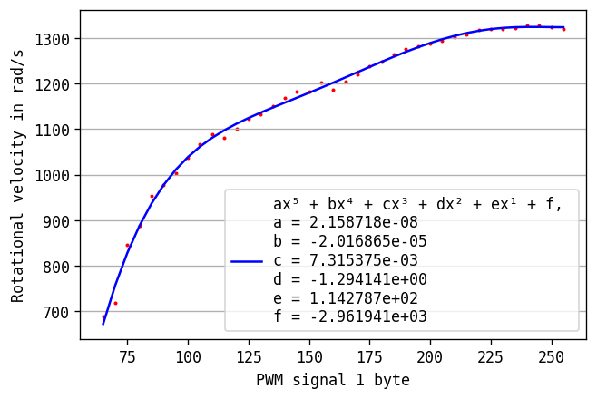

# A 3D locomotion model.
This is a locomotion model for the dezibot v3.

# Basics
coordinate system with EUN orientation.

---
## Velocity
Velocity consists of linear and angular velocity.

The unit of linear velocity is m/s and angular velocity rad/s.
```
V = [X, Y, Z, X_R, Y_R, Z_R]
```
---
## Position
Meter.
```
P = [X, Y, Z]
```
---
## Orientation
3x3 rotation matrix
```
R =
[ R[0] R[1] R[2] ]
[ R[3] R[4] R[5] ]
[ R[6] R[7] R[8] ]
```
---
## Motor
The locomotion is based on two vibration motors which can be powered by a 8 byte PWM signal.

The voltage can be approximated by
```
U = PWM / 255 * 3,3
```

The angular velocity of the flywheel can be approximated by the following function:


